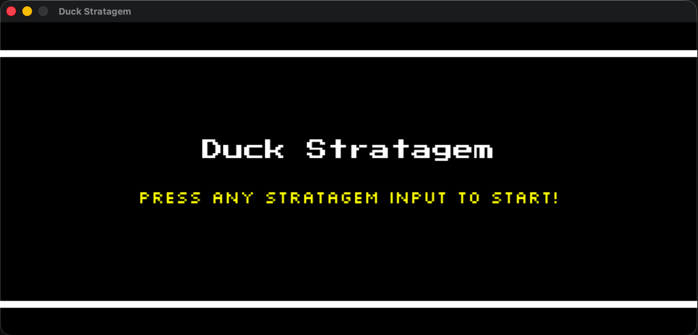
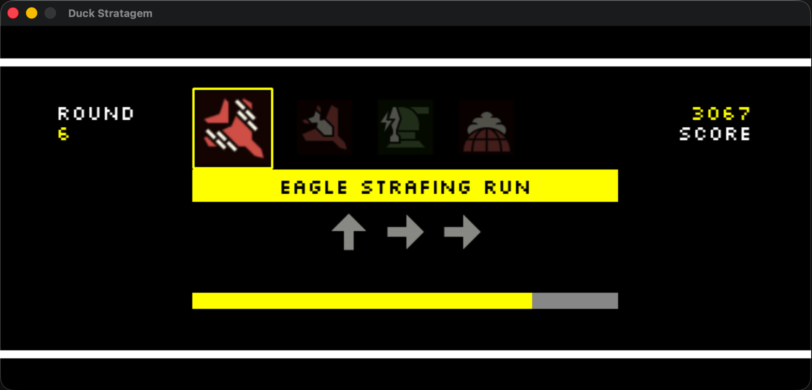
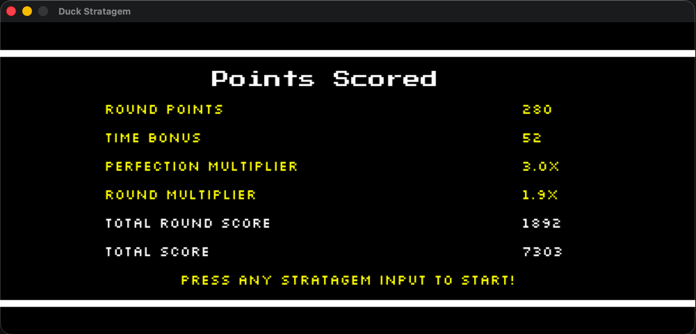
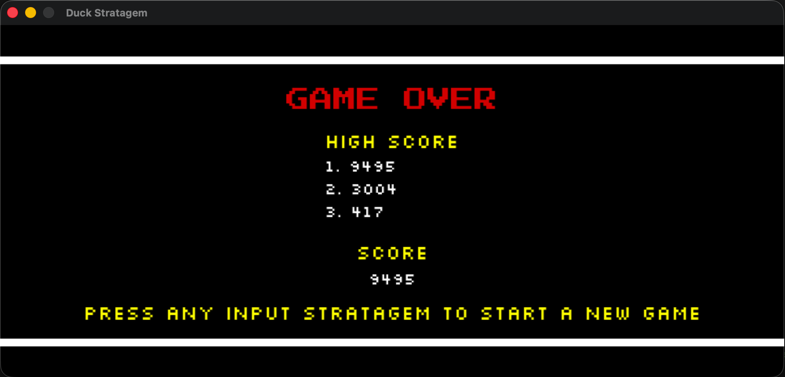

# Duck Stratagem

The Helldivers 2 arcade game (Stratagem Hero) made with python using pygame

## Features

- Savefile: Uses a savefile system where the game saves high scores of past games to show your own personal best.
- Pygame: Uses Pygame to: display a window for the game, tracks keybaord input and display images and text.
- PyPi: Uses Pypi to easily access/play the game by installing the package using pypi.

## Images

## How to Access

Requirements:

- MacOS or Linux device
- Python 3.9 or later (the latest to be safe)
- Pip 22 or later (the latest to be safe)

## How to Play

